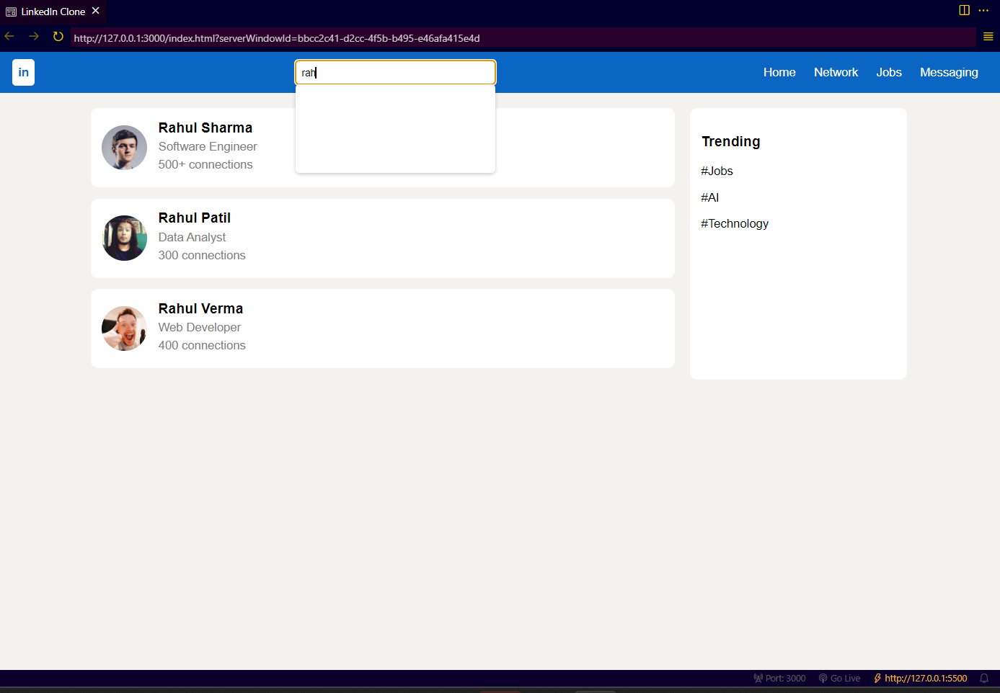
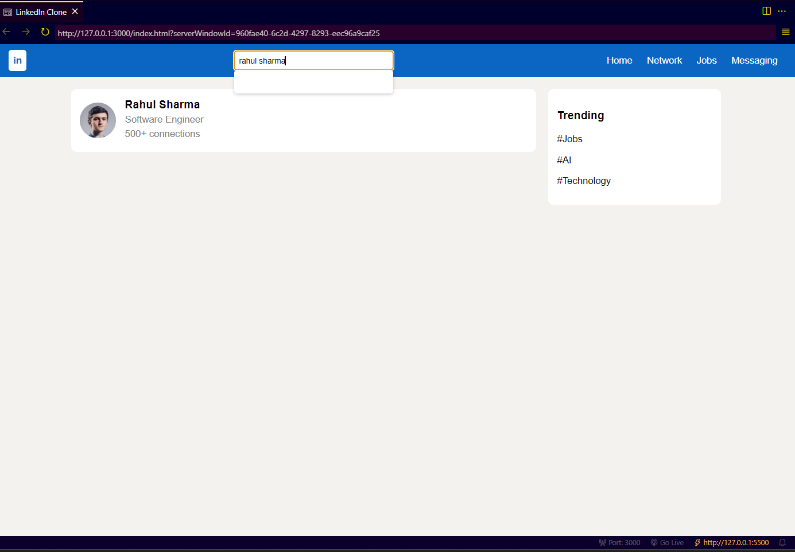

# LinkedIn Profile Search System

## 📌 Overview

This project is a simple web-based implementation inspired by LinkedIn. It focuses on the profile search functionality, where users can search and view profiles dynamically.

## 🎯 Objective

The objective of this project is to design a user interface similar to LinkedIn and implement a working search feature using JavaScript.

## ⚙️ Functionality

* Search profiles using name input
* Display matching profiles dynamically
* Show suggestions while typing
* Handle no results scenario

## 🧠 Features Implemented

* LinkedIn-like user interface
* Profile cards with image, name, and details
* Real-time filtering using JavaScript
* Interactive search suggestions

## 🛠 Technologies Used

* HTML
* CSS
* JavaScript

## 🔍 Clone Description

This project is a partial clone of LinkedIn focusing only on the profile search feature.

## 📸 Screenshots

### Search Suggestions

### Results Display

## 🚀 Conclusion

The project successfully demonstrates how a LinkedIn-like search system works using basic web technologies.
